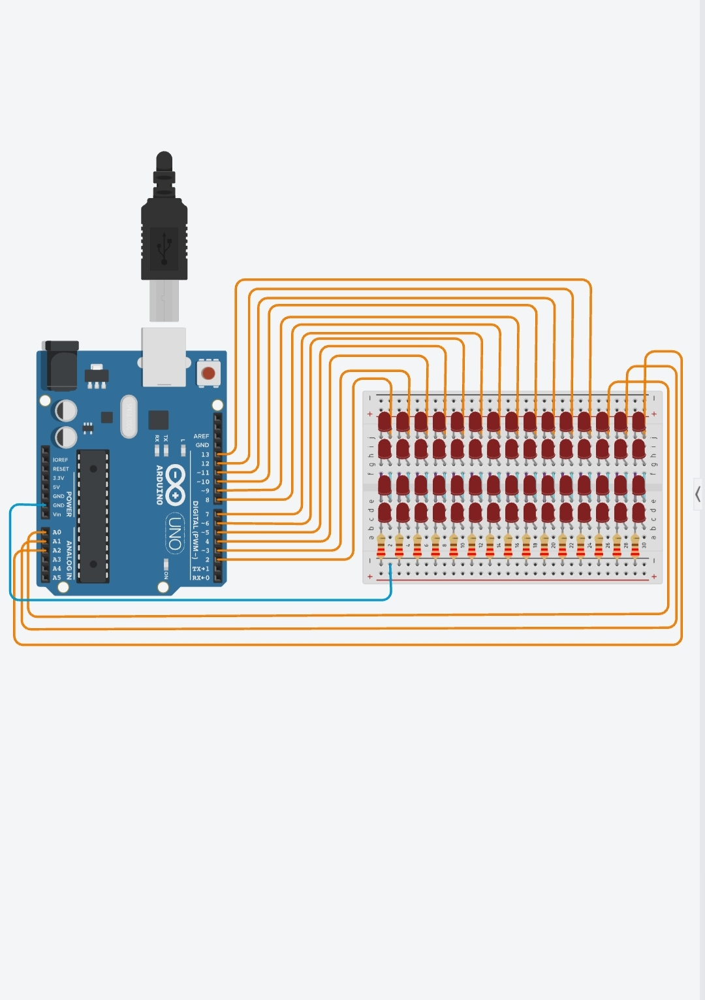

# Arduino LED Animation Effects Project

## Hardware / Components

- Arduino Uno
- Total 60 LEDs (15×4 Sets)
- 220Ω Resistors
- Breadboard
- Jumper Wires

## Connection

- LEDs connected to Arduino pins D2-D13 and A0-A2

## Connection Diagram

## LED Effects Included

1. All LEDs ON/OFF Effect
2. Running Light Left to Right
3. Running Light Right to Left
4. Fill Up Effect
5. Empty Down Effect
6. Alternate LEDs Blink Effect
7. Odd LEDs ON / Even LEDs OFF Effect
8. Bounce Effect
9. Reverse Effect
10. Knight Rider Effect
11. Wave Effect
12. Random Blink Effect
13. Snake Effect
14. Ripple Effect
15. Chase Effect
16. Twinkle Effect
17. Fireworks Effect
18. Heartbeat Effect
19. Rain Effect
20. Meteor Shower Effect
21. Explosion Effect

## Project Description

Arduino Uno based LED animation project with multiple lighting effects. This project is created to learn Arduino programming and LED control using digital and analog pins.
